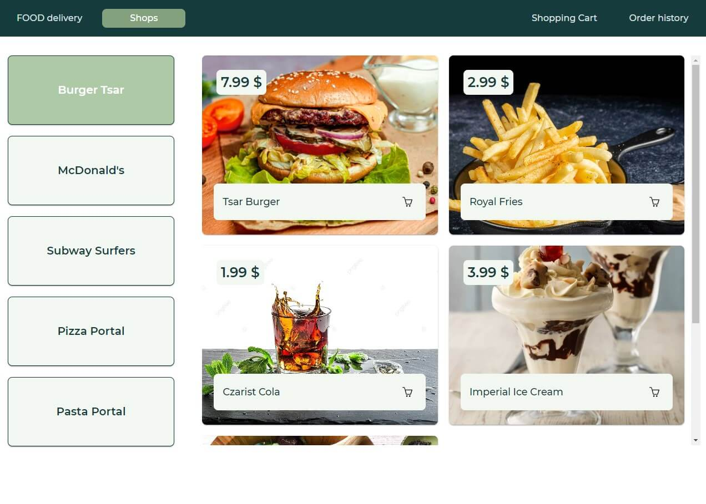

# Food Delivery

## On this website you have the opportunity to order food from your favorite stores! And also you can review your order history.

## <ul>Main functionality:</ul>
<li>You choose the products you like and they are added to the shopping cart</li>
<li>In the shopping cart, you can change the quantity or remove a product from the cart</li>
<li>Fill in your contacts in the form and send the order </li>
<li>On the Order history page, enter your email and phone number and get order data </li>

## Used technologies:

- React.js
- React-Router-Dom
- Axios
- Styled Components
- Formik and yup for form validation
- React-hot-toast for cool toast notifications

## Backend Repository

You can also check out the backend repository [here](https://github.com/JustIrish/Food-delivery-back).
